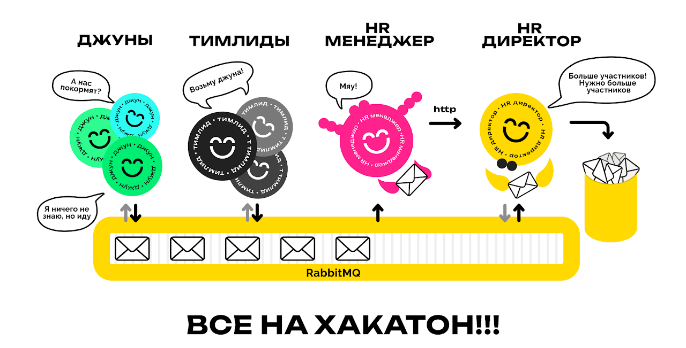

# [Все на хакатон](https://sites.google.com/view/fitnsudotnet)



В одной IT компании захотели сформировать команды мечты. Для этого начинающий HR менеджер предложил умудрённому опытом
HR директору провести хакатон.

На хакатон позвали 20 тимлидов и 20 джунов. Разработчикам предложили поработать вместе и к концу мероприятия составить
списки коллег, с которыми они хотели бы работать в одной команде. Каждый тимлид составляет список из 20 джунов, ставя на
первое место наиболее предпочтительного кандидата, на второе следующего по предпочтительности и далее по убывающей.
Джуны, в свою очередь, таким же образом оценивают тимлидов. Все списки должны состоять из 20 пунктов, пункты не должны
повторяться. В списках тимлидов могут быть только джуны, в списках джунов только тимлиды.

Все эти списки передаются нашему начинающему HR менеджеру, который уже пообещал придумать инновационную стратегию
формирования команд мечты. Каждая команда должна состоять из пары: тимлид + джун. Список команд он передаст HR
директору.

Все было бы просто, но умудрённый опытом HR директор придумал как математически точно оценить гармоничность команд. Для
этого он предложил посчитать индекс удовлетворённости каждого из разработчиков. Например, если тимлиду попался наиболее
желаемый джун, то он получает 20 очков удовлетворённости, если второй по списку, то 19 и так далее вплоть до 1. Точно
так же рассчитывается индекс удовлетворённости джунов их тимлидами.

Далее HR директор подсчитывает среднее гармоническое индексов удовлетворённости всех участников. Именно это число HR
директор предложил считать гармоничностью распределения. Основная цель начинающего HR менеджера при выборе стратегии
распределение по командам - чтобы гармоничность мероприятия была как можно выше.

Хакатон проводится несколько раз. Необходимо вычислить среднюю гармоничность как среднее арифметическое по всем
мероприятиям, то есть вычислить среднее арифметическое средних гармонических.

## [Задача 1: ООП](https://github.com/sysfutex/HackathonProblem/tree/task-1-oop)

Реализовать консольное приложение, списки предпочтений определяются случайно. Списки участников необходимо считывать из
файлов (`Teamleads20.csv` и `Juniors20.csv`), файлы взять из репозитория [
`git@github.com:georgiy-sidorov/CSHARP_2024_NSU.git`](https://github.com/georgiy-sidorov/CSHARP_2024_NSU).

Хакатон проводится 1000 раз. Приложение должно вывести в консоль уровень гармоничности по всем 1000 мероприятиям, а
также среднее по всем.

Само приложение не должно скачивать файлы с GitHub во время работы, нужно скачать их и разместить рядом с исходным кодом
решения.

## [Задача 2: .Net Generic Host](https://github.com/sysfutex/HackathonProblem/tree/task-2-dotnet-generic-host)

Поместить песочницу в .Net Generic Host. Выделить в отдельные зависимости:

* класс, реализующий проведение одного хакатона;
* класс, реализующий HR менеджера;
* класс, реализующий HR директора;
* стратегию HR менеджера.

Например, инициализация хоста может выглядеть следующим образом:

```csharp
using Microsoft.Extensions.DependencyInjection; 
using Microsoft.Extensions.Hosting; 

var host = Host.CreateDefaultBuilder(args) 
    .ConfigureServices((hostContext, services) => 
    { 
        services.AddHostedService<HackathonWorker>(); 
        services.AddTransient<Hackathon>(_ => new Hackathon()); 
        services.AddTransient<ITeamBuildingStrategy, TeamLeadsHateTheirJuniorsTeamBuildingStrategy>(); 
        services.AddTransient<HrManager>();
        services.AddTransient<HrDirector>(); 
  	}).Build(); 

host.Run(); 
```
